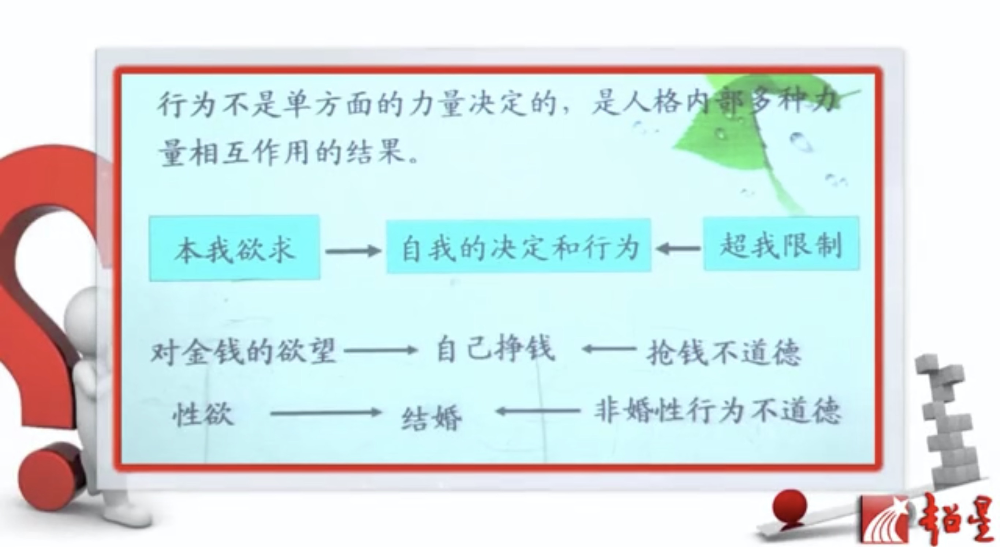

## 课前鸡汤

阅读文献的能力（英文文献）

完善人格方面：勤奋、自信（天生我材必有用）、乐观、坚持、上进心

## 课程基本介绍

### 研究内容

1. 如何记忆？
2. 老板如何激励人？（动机）
3. 如何心理调节？
4. 智力水平和人格如何测？
5. 青春期的孩子有何特点、教育问题
6. 恐高症的原因，如何解决
7. 如何选拔具有某种特质的人？（人力资源）
8. 初次约会之后什么因素决定能否下次再约会（长相，往往男士更看重）

### 教学目标

性质：基础、入门课

目标：心理学基本概念与理论、心理学研究方法、分析问题与解决问题的方法（给出情境学会分析）

### 参考书目

1. 津巴多《普通心理学》
2. 津巴多《心理学与生活》 
3. 《心理学的故事》
4. 《改变心理学的40项研究》
5. 《登天的感觉》（讲心理咨询）

---

## 心理学研究对象

### 心理学研究什么

联想三个词语 ——〉普通大众容易误解心理学，理解不全面

常见的误解：

1. 心理学不研究人每时每刻想什么
2. 不等同于心理咨询（心理学的应用）
3. 不等同于研究变态
4. 催眠，解梦（受弗洛伊德的影响）

到底研究什么？

研究对象：**心理、行为**

研究的角度：个人不受外人的影响（个体心理）、个人收到别人的影响（社会心理）

#### 个体心理

共性方面：

1. **认知**：信息接收、加工、存储、支配行为的过程，智力水平由认知能力来测量
2. **情绪和动机**：认知过程中产生的体验，对心理和行为起到调节和控制的作用

差异性方面：

1. **智力**（智商成正态分布）
2. **人格**

#### 社会心理

研究人的思想、情感和行为，怎样收到真是的或者想象的他人存在的影响

1. **社会促进**：由于别人在场，增强个体竞争动机
2. **社会惰化**：群体完成任务，个体努力程度变少（责任分工不明确，责任的分散）

例子：

- 旁观者效应：震惊全美的吉诺维斯事件，被歹徒迫害30分钟，中途没人报警

  原因：责任分散

  启示：旁观者越多，得到救助的可能性越低，此时应该将责任指定到个人

- 货车侧翻，车上葡萄遭村民哄抢

  原因：

  - 法不责众的心理
  - 从众心理
  - **去个性化**：个人在群体的压力或群体意识下，自我责任感的丧失，产生一些个人单独活动时不会出现的行为

#### 行为

- 定义：在主客观因素影响之下产生的可观察的外部活动
- 与心理的联系：心理支配行为，由行为反推心理

### 现代心理学的门类

- 理论心理学

  普通心理学、发展心理学、学习心理学、认知心理学、人格心理学、社会心理学、变态心理学、生理心理学、实验心理学、比较心理学

- 应用心理学

  教育、咨询（面对正常人）、临床（面对有心理障碍的人）、工业（工作中的心理特点）、医学、犯罪、广告、管理心理学……

## 心理学研究目标

对心理现象进行**描述、解释、预测、控制**

- 描述：描述现象是什么？
- 解释：为什么出现这种现象？
- 预测：作出预测
- 控制：控制心理和行为

## 心理学的应用

1. **教育**（应用最广）：了解学生心理、为教育服务

   - 罗森塔尔效应：由于他人的期望，使得行为趋于期望发展的现象---->老师对学生的评价很重要，应该多鼓励、赞扬、信任

2. **心理咨询**：面对的是正常人，重点在心理辅导

   - 案例：“花心少女”，经常换男朋友。

   - 原因：母亲严厉，小时候爸爸有外遇和妈妈离婚，将原因归结于自己不乖---->自我认同出错、光看消极的一面，通过换男朋友建立自信心

   - 如何帮助：转变看事物的方式

3. **心理治疗**：帮助心理障碍者

   - 案例：怕狗

   - 治疗方法：系统脱敏疗法

     确定一个害怕的等级，做放松训练，从最轻的等级一直到最严重的等级

4. **工业和组织心理学**

   - 选拔员工

     结构化面试：面试的问题、实施、答案都是有结构的---->减少主观的因素，更客观

   - 激励下属：工作态度和工作动机

5. **消费心理学**

   - 最小单位定价策略
   - 打折

## 心理学性质

中间学科

## 心理学研究方法

实验者效应（偏差）：实验者本人有意或者无意地暗示被试者从而影响实验结果

**单盲实验**：被试不知道实验的目的

**双盲实验**：主试和被试都不知道实验目的

### 基本方法

1. 观察法

   定义：**在自然的条件下**，对表现心理活动的外部活动进行系统的有计划的观察，从而发现规律性

   例：珍妮古道尔观察黑猩猩

   哪些情况用观察法：

   - 观察的对象或者现象无法控制
   - 控制条件下，可能影响某些现象的出现
   - 违法社会伦理时

   优点：保持心理的自然性，结果比较真实

   缺点：结果有时难以检验和证实。受研究者主观因素的影响大，易产生观察者偏差。不能得出确切的因果关系。

2. 实验法

   心理学诞生得益于实验方法的采用，从哲学中分化出来

   - 定义：**在控制条件下，操纵自变量**，然后观察自变量与因变量之间关系的一种研究方法

   - 分类：自然实验，实验室实验（根据实验的环境划分）

   - 关键：**操纵自变量，控制无关或混淆变量**

   - 无关变量：影响实验的结果，但是本实验中并不关心
   
   - 常用因变量：**反应时（RT)**
   
     反应时：刺激施于有机体之后到明显反应开始所需要的时间，当涉及到快速信息加工时多以反应时为因变量
   
3. 心理测验法

   定义：用一套预先经过标准化的问题（量表）来测量某种心理现象的方法

   标准化：施测的题目、过程、评分标准和对分数的解释都是一样的

   两个基本的要求；

   - 信度：测验的可靠程度
   - 效度：是否有效地测量了你要测的东西
   
4. 个案法

## 心理学史

> 心理学有漫长的过去，短暂的历史——艾宾浩斯

科学心理学的诞生：1879年冯特在德国莱比锡大学建立第一个心理学实验室，**心理学从哲学中分离出来**

### 西方心理学派别

| 学派     | 构造主义                                                     | 机能主义                                                     | 格式塔                                               |
| -------- | :----------------------------------------------------------- | ------------------------------------------------------------ | ---------------------------------------------------- |
| 代表人物 | 冯特、铁钦纳                                                 | 威廉詹姆斯、杜威                                             | 韦特海默、科勒、考夫卡                               |
| 研究对象 | 直接经验，即意识                                             | 意识                                                         | 意识                                                 |
| 观点     | 复杂的意识由简单的元素构成，由感情、意象和情感三种成分构成   | 1.研究意识或心理的作用和功能 2.意识不是个别元素的集合，是连续的整体，意识的功能在于使有机体适应环境 | 心理是一个整体，整体不等于部分之和，整体大于部分之和 |
| 评价     | 问题：主观，研究内容过于狭窄，研究脱离实际，割裂了心理的整体性 | 促进了在教育、临床、工业等领域的应用                         |                                                      |

| 学派     | 激进的行为主义                                               | 新行为主义                                                   | 精神分析                                                     |
| -------- | ------------------------------------------------------------ | :----------------------------------------------------------- | :----------------------------------------------------------- |
| 代表人物 | 华生                                                         | 斯金纳、托尔曼                                               | 弗洛伊德                                                     |
| 研究对象 | 外显的行为、决定行为的因素，刺激-反应（S-R)                  | 行为、决定行为的因素                                         | 异常行为                                                     |
| 观点     | 1.行为是有机体适应环境的活动、引发活动的是刺激 2.人的行为由环境因素决定 3.反对使用内省，提倡实验的方法 | 1.承认内部心理活动对行为的作用，承认刺激S-R之间存在一个中介变量（o）（机体的因素）2.强化：用强化物诱使行为反应概率增加的过程，分正强化（行为在先，强化物在后）、**负强化（终止不愉快的刺激增加行为发生的概率，厌恶性刺激在先，行为在后，不是惩罚！！）**3.惩罚：减少行为反应发生概率的手段，增加厌恶性刺激，或取消喜欢的刺激 | 1.性欲论：人行为的动机根源于心灵深处本能的欲望，特别是性欲 2.人格理论：**潜意识**（与本能相关，感受不到）、**前意识**（仔细回想能进入意识的东西）、**意识**（能感受到的）——>冰山理论 3.后期理论： **本我**、**自我**（调节作用，遵循现实）、**超我**（道德化的东西，抑制本我，遵循道德） |
| 评价     | 忽视了个人主观能动性，片面                                   | 1.使心理学走向客观研究的道路，丰富了心理学的研究领域，促进了应用 2.不研究心理，限制了心理学的发展 | 心理学中影响最大的理论之一                                   |

补充：斯金纳箱例子

- 正强化：小白鼠按压按钮，得到食物，从而使小白鼠按压按钮的行为概率提高
- 负强化：小白鼠在箱中被电击，按压按钮电击消失，从而使小白鼠按压按钮的行为概率提高

### 当代心理学研究取向

1. 生理心理学研究取向

   认知神经科学——揭示大脑的秘密

   - 研究方法：临床解剖、电刺激、**脑功能成像**（对大脑无创伤）

     - 事件相关电位（ERP)

       原理：在头皮上记录大脑受到刺激时产生的电位

       特点：**实时**反应大脑认知活动的过程，**高时间分辨率，低空间分辨率**

       细节：N400（负波，向上）反应语义的整合加工，P600（正波，向下）反应句法语法
     
     - 功能性磁共振成像（fMRI)
     
       原理：通过观察认知活动中大脑中的血流量和血中的含氧量，推知大脑不同部分的功能
     
       特点：**高空间分辨率，低时间分辨率**（有延迟）
     
       例子：
     
       1. 早期双语者激活布洛卡区相同区域，晚期双语者激活布洛卡区不同区域
       2. 爱情时负责推理的额叶区处于不活跃状态，憎恨时额叶区处于活跃状态
       3. fMRI检测视皮层反应推测人看到的图片

2. 认知心理学研究取向

   观点：

   - 强调认知过程的研究，认知因素在行为中的作用

   - 把人与计算机的功能做类比，用信息加工的观点研究认知过程

   - 采用实验、计算机模拟的方法

3. 人本主义心理学

   观点：

   - 强调研究健康人的心理，研究出类拔萃的精英
   - 强调人的潜能和价值，人性美好————区别于精神分析，行为主义性本恶
   - 强调环境和自我的因素对行为的作用

4. 积极心理学

   观点：研究普通人的活动与美德

