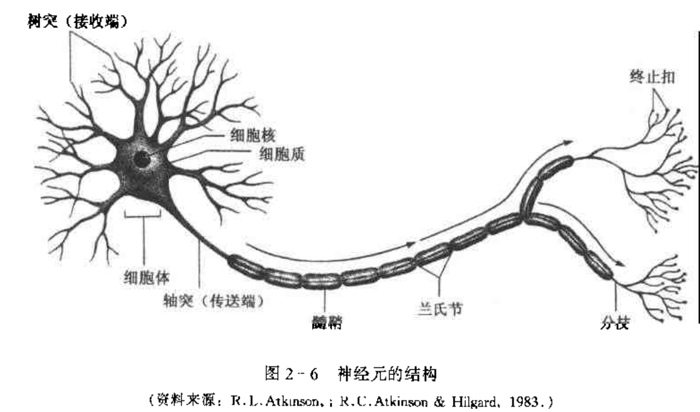

## 重点问题

- 大脑机构和功能
- 左右半球不同的功能
- 脑功能的学说

## 神经系统的进化

单细胞动物——>多细胞动物——>脊椎动物复杂的神经系统——>人脑

1. 脑重占体重的比例增大
2. 大脑新皮层的容积不断增大
3. 大脑皮层结构更复杂

## 神经元（略）

### 结构

- 树突：接受刺激，并把刺激传递给胞体
- 胞体：整合来自树突和其他神经元的信息
- 轴突：传导信息

信息传导方向：胞体——>轴突

### 功能

接受、整合和传导信息

## 神经系统的结构和功能（重）

